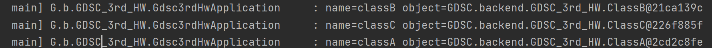
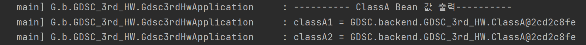

# This Week What I Learned - Week 3
======

##### POJO (Plain Old Java Object)
: 객체지향 원리에 충실, 필요에 따라 재활용될 수 있는 방식으로 설계된 오브젝트

1. 특정 규약에 종속되지 않는다
- 자바 언어 & 꼭 필요한 API 이외에는 종속 X
- 객체지향 설계의 자유로운 적용이 가능한 오브젝트
2. 특정 환경에 종속되지 않는다
- 특정 환경에 종속되어야만 동작하면 X
- 비지니스 로직을 담고있는 클래스나 인터페이스 사용 X
3. 객체지향적인 자바 언어의 기본에 충실하게 만들어져야 한다

**장점**
- 종속되지 않음 -- 코드가 깔끔해짐
- 환경에 제약이 없음 -- 자동화된 테스트에 좋음
- 객체지향적 설계 자유롭게 적용 가능

##### Spring
: POJO로 개발된 앱 핵심 로직 코드에 서비스 기술을 제공
- 경량 컨테이너로 자바 객체를 직접 Spring 안에서 관리
- 객체의 생명주기(생성, 소멸) 관리, Spring 컨테이너에서 필요한 객체를 가져와 사용
- IoC/DI: 한 클래스의 변경에 대해 다른 클래스의 변경 최소화
-> 애플리케이션의 지속 가능성과 확장성 증가

**IoC: 제어의 역전**
- 제어: 직접 객체를 생성하여 코드를 관리함 (객체 생명주기, 메서드 호출)
- 역전: 제어 흐름을 직접 제어하는 것이 아니라 외부에서 관리

- 역할과 관심을 분리해 응집도 높이고 결합도 낮춤
-> 변경에 유연한 코드 작성하는 구조

##### Spring IoC Container
: 빈을 관리하는 객체
- ApplicationContext 인터페이스가 대표적

##### Spring Bean
: 스프링 IoC 컨테이너에 의해 관리되는 자바 객체

**빈 스코프**
: 빈의 생성, 존재, 적용 범위
- @Scope 애너테이션을 통해 지정 가능

1. 싱글톤: 기본 스코프. 스프링 컨테이너의 시작~종료까지 유지되는 가장 넓은 범위의 스코프
2. 프로토타입: 스프링 컨테이너가 프로토타입 빈의 생성~의존관계 주입까지만 관여. 더이상 관리하지 않는 매우 짧은 범위의 스코프
3. 웹 관련 스코프 (request, session, application)

##### Spring Bean 등록 방법
: @Bean 애너테이션 & @Configuration 애너테이션 사용
- @Bean: 객체를 new로 생성하는 메서드에 붙여 객체를 스프링 빈으로 등록
- @Configuration: 스프링 빈을 싱글톤으로 관리함
- ApplicationContext의 구현체에 파라미터로 넘긴 값(해당 객체에 빈으로 등록한 것들 모두 포함) 스프링 빈으로 등록됨.
- 빈을 싱글톤으로 생성하려면? @Configuration을 사용한 객체를 ApplicationContext의 파라미터로 넘기면 됨.
- 번거롭다면? @Component 애너테이션 사용하기.

**Component Scan**
: 스프링이 애플리케이션의 클래스를 검색하고 자동으로 스프링 빈을 등록
- @Component: 스프링 빈으로 등록하려는 클래스에 붙임
-> 스프링은 @Component가 붙은 클래스를 자동으로 검색하고 빈으로 등록함.
- @ComponentScan: 검색할 패키지의 범위 설정
-> @SpringBootApplication (스프링 프로젝트의 루트 클래스에 붙는 애너테이션)에 포함되어 있음.
- Component Scan의 대상: @Configuration, @Service, @Controller, @Respository 애너테이션이 붙은 클래스

##### 로그

