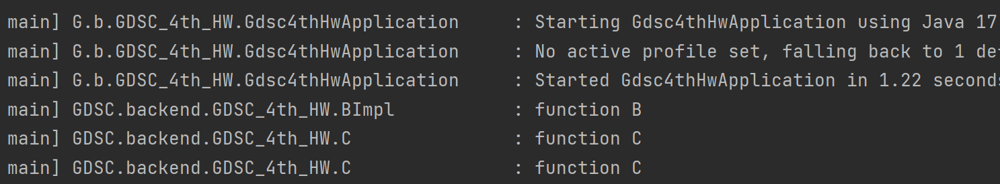

# This Week What I Learned - Week 4
======

##### DI (Dependency Injection)
: 의존성 주입. 외부에서 두 객체 간 관계를 결정하는 디자인 패턴
- 클래스 레벨에서는 의존관계가 고정되지 않음.
- 런타임에 관계를 동적으로 주입. 유연성 확보 & 결합성 감소
- Spring에서 가장 많이 쓰는 방법: @Autowired 애너테이션 이용

**종류**
1. 생성자 주입: 객체 최초 생성 시점에 스프링의 의존성을 주입함. 
-> 생성자에 @Autowired 붙여서 사용

2. 수정자 주입: 수정자 메서드로 의존관계 주입. 선택, 변경 가능성 있는 의존관계에 사용. 
-> setter에 @Autowired 붙이면 스프링이 자동으로 의존성을 주입해줌.
-> 빈 객체에 setter로 의존성 주입하는 방법. 빈 생성자가 필요.

3. 필드 주입: 필드에 바로 주입. 단점이 많아 잘 사용하지 않음.
-> 필드에 @Autowired 붙여서 사용

4. 일반 메서드 주입: 생성자, setter 이외의 다른 메서드를 사용해 의존성을 주입함. 일반적으로 사용하는 방법이 아님.

##### Spring Boot
: 스프링 기반 어플리케이션을 빠르게 개발, 실행하기 위한 프레임워크
- 개발 저항(개발 구성이 무거움)을 해결하기 위해 만들어짐.

**특징**
1. WAS: Tomcat 같은 웹서버 내장하고 있음. 별도의 웹서버 설치할 필요 없음
2. 라이브러리 관리: 스프링부트가 스타터 종속성과 라이브러리 버전 관리를 제공함.
3. 자동 구성: 프로젝트 시작에 필요한 빈 자동 등록 & 스프링 애플리케이션에 공통으로 필요한 기능 자동으로 구성
4. 외부 설정: 환경에 따라 달라져야 하는 외부 설정을 공통화함
5. 프로덕션 준비: 모니터링을 위한 메트릭, 상태 확인 기능 제공

##### 로그
